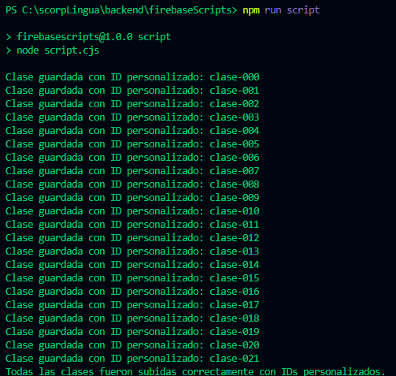
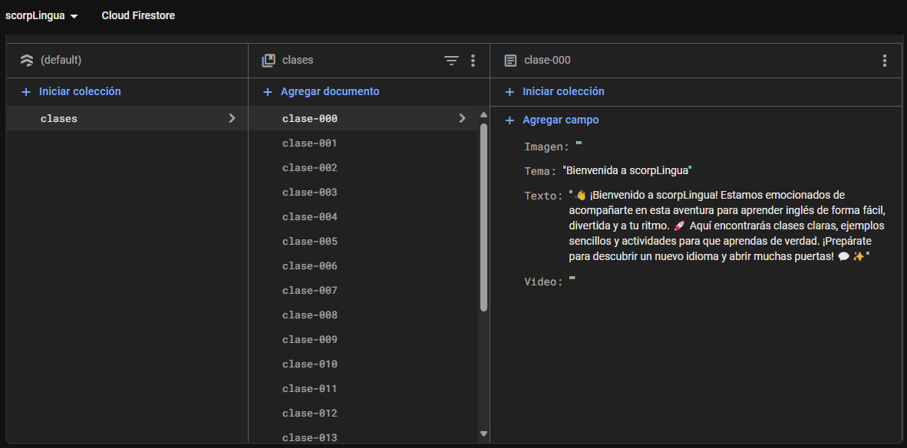

# SCRIPTS
Dentro de nuestro proyecto necesitamos hacer teoria y ejercicios para que en un futuro mostremos esa informacion al usuario.
Siguiendo la documentacion de FireStore, nuestro objetivo es automatizar los procesos asignando a nuestra coleccion toda una automatizacion de documentos. Que en este primer caso son las clases de teoria que tendra nuestra app, el nombre dentro de la coleccion es asignado en base a la posicion del JSON que tenemos en nuestras clases con JSON

