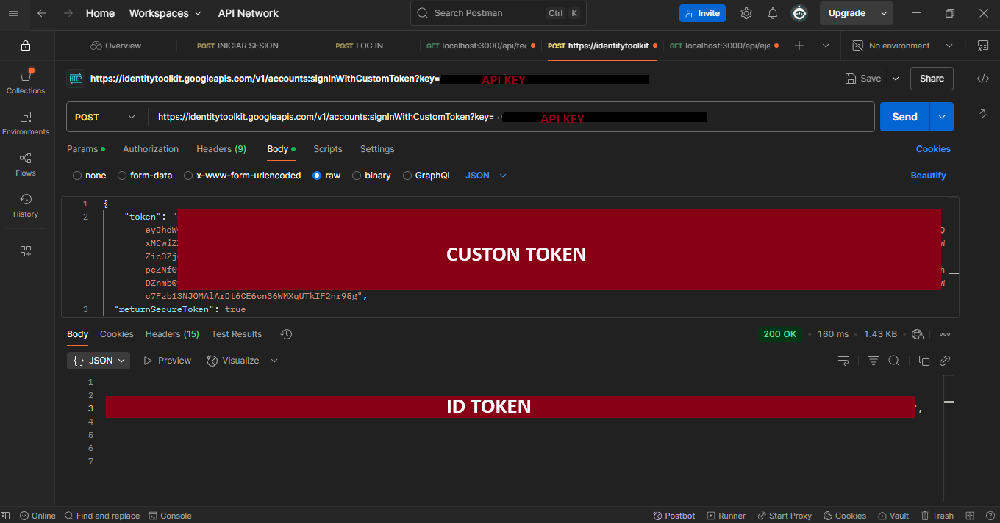
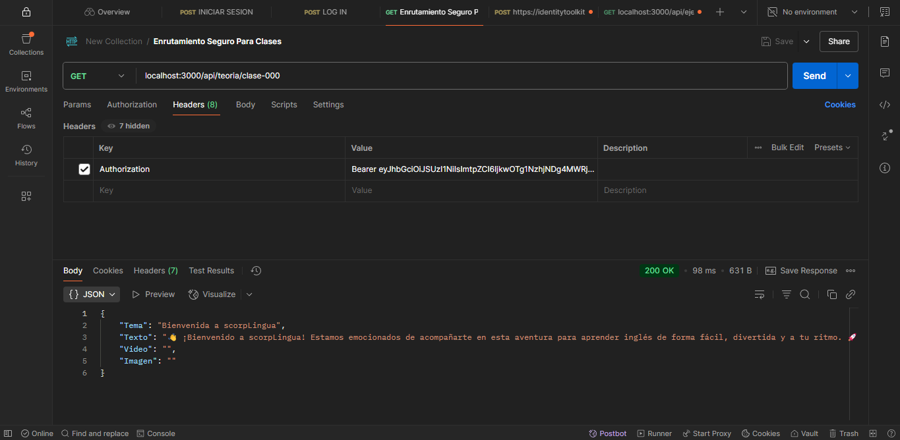

# Documentación de la reestructuración con Firebase Admin SDK

Durante el desarrollo de las rutas, surgieron varios problemas utilizando el SDK de cliente de Firebase, especialmente en la gestión de tokens para un enrutamiento seguro. Debido a las limitaciones del SDK de cliente, optamos por una reestructuración total utilizando el **Firebase Admin SDK**, permitiendo un control total sobre la autenticación y validación de sesiones.

## Modelado de Usuarios

Firebase no provee un sistema de definición de esquemas de datos como lo hace Mongoose para MongoDB. Por ello, se utilizó **ZOD** para definir los esquemas de validación de usuarios.

### Estructura del Usuario

```json
{
    "username": "SCORPION_PRUEBA8",
    "sexo": "M",
    "fNacimiento": "04-26-2000",
    "email": "emailDeEjemplo8@gmail.com",
    "password": "holaComoEstasAmigooo",
    "idiomaOrigen": "español",
    "idiomaAprender": "Inglés",
    "eresMaestro": true,
    "profilePic": "https://dame-un-valor-x-c.com",
    "ejercicios": {
        "ejerciciosPorDia": []
    }
}
```

Este esquema es validado al momento de la creación del usuario para garantizar integridad de datos.

# Módulo `auth.controller.mjs`

Este módulo contiene las funciones principales para el manejo de autenticación de usuarios usando Firebase Authentication y Firestore.

## Funciones principales

### `signup(req, res)` - Registro de Usuario

- **Entrada:**
  - `req.body`: Debe contener `email`, `password`, `username`, y demás datos del usuario.
- **Proceso:**
  1. Validar datos usando `UserSchema` (ZOD).
  2. Crear usuario en Firebase Authentication.
  3. Generar un **Custom Token**.
  4. Guardar datos adicionales en la colección `users` en Firestore (sin contraseña).
  5. Retornar un `201` con token, ID de usuario y datos básicos.
- **Errores:**
  - Error de validación (`400`)
  - Errores internos (`500`)

### `login(req, res)` - Inicio de Sesión

- **Entrada:**
  - `req.body`: `email` y `password`.
- **Proceso:**
  1. Buscar usuario en Firebase Authentication.
  2. Generar **Custom Token**.
  3. Obtener información adicional desde Firestore.
  4. Retornar `200` con token y datos del usuario (sin contraseña).
- **Errores:**
  - Usuario no encontrado o error de autenticación (`401`)

### `logout(req, res)` - Cierre de Sesión

- **Entrada:**
  - `req`: No requiere cuerpo específico.
- **Proceso:**
  1. Confirmar cierre de sesión.
  2. Retornar `200` con mensaje de éxito.

## Middleware de Autenticación

Este middleware protege rutas privadas mediante la verificación del **ID Token**.

- **Funcionamiento:**
  1. El cliente guarda el Custom Token al iniciar sesión.
  2. Luego, solicita a la API de Google un **ID Token** utilizando el Custom Token.
  3. El cliente debe enviar el ID Token en el `Authorization Header` de sus peticiones: `Bearer <idToken>`.
  4. El middleware separa y verifica el ID Token usando funciones del Firebase Admin SDK.
  5. Si es válido, se permite el acceso a la ruta.

### Visualizaciones de pruebas

- **Obtener ID Token**
  - 

- **Enrutamiento seguro**
  - 

# Consideraciones

- **Firebase Authentication** maneja la seguridad de contraseñas y autenticación.
- **Firestore** almacena información adicional de usuarios.
- **ZOD** asegura la validez de los datos.
- Se implementó seguridad basada en **ID Tokens** para asegurar rutas de manera robusta.

---

**Importaciones clave:**
- `admin` → Instancia de Firebase Admin SDK.
- `db` → Instancia de Firestore.
- `UserSchema` → Esquema de validación de usuarios (ZOD).

# Estado actual

- **Registro e inicio de sesión funcionando.**
- **Middleware de protección de rutas activo.**
- **Enrutamiento seguro implementado.**
- **Trabajo en curso para expandir las funcionalidades.**
